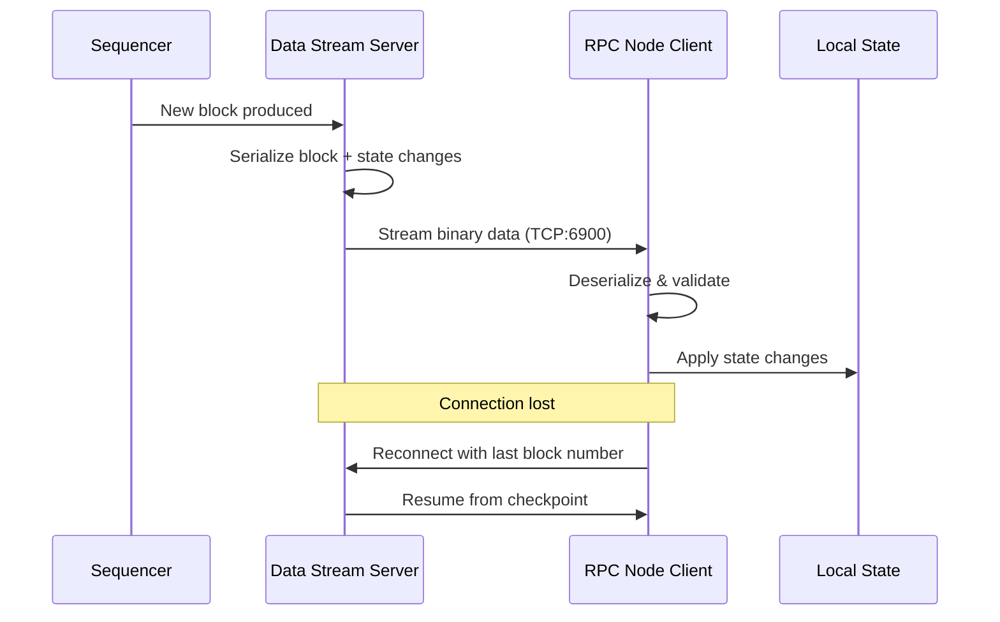

# Data Stream

The data stream protocol enables efficient synchronization from sequencers.

## Client Configuration (RPC Node)

Connect to a sequencer's data stream:

```yaml
zkevm:
  l2-datastreamer-url: stream.zkevm-rpc.com:6900
```

## Server Configuration (Sequencer)

Expose data stream for RPC nodes:

```yaml
zkevm:
  data-stream-port: 6900
  data-stream-host: 0.0.0.0
```

## Protocol Details

- Binary protocol over TCP
- Streams blocks, batches, and state changes
- Supports reconnection and resume



## Troubleshooting

### Connection Issues

- Verify network connectivity to stream endpoint
- Check firewall rules
- Ensure correct port configuration

### Sync Delays

- Monitor data stream lag
- Check sequencer health
- Verify L1 sync status

## Next Steps

- [Deprecated Flags](./deprecated) - Removed options
- [Troubleshooting](../troubleshooting/sync-issues) - Sync problems
