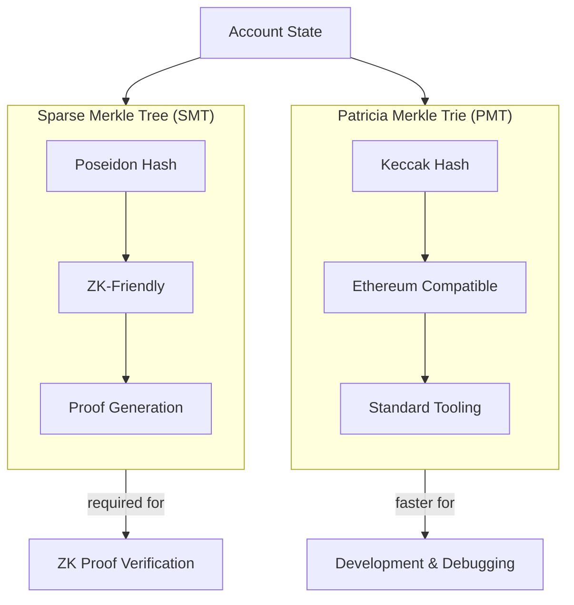

# State Trie Selection

cdk-erigon supports two state trie implementations.



## Sparse Merkle Tree (SMT)

- Uses Poseidon hashing (ZK-friendly)
- Required for ZK proof generation
- Default for zkEVM networks

```yaml
zkevm:
  initial-commitment: smt
```

## Patricia Merkle Trie (PMT)

- Standard Ethereum trie
- Compatible with existing tooling
- Faster for some operations

```yaml
zkevm:
  initial-commitment: pmt
```

## Regeneration Options

### In-Memory Regeneration

Faster but requires more RAM:

```yaml
zkevm:
  smt-regenerate-in-memory: true
```

### Disk-Based Regeneration

Slower but lower memory usage:

```yaml
zkevm:
  smt-regenerate-in-memory: false
```

## When to Use Each

| Use Case | Recommended |
|----------|-------------|
| Production RPC | SMT |
| Proof generation | SMT |
| Development | Either |
| Memory-constrained | PMT or disk-based SMT |

## Next Steps

- [L1 Interaction](./l1-interaction) - L1 configuration
- [Performance Tuning](../operations/performance-tuning) - Optimization
