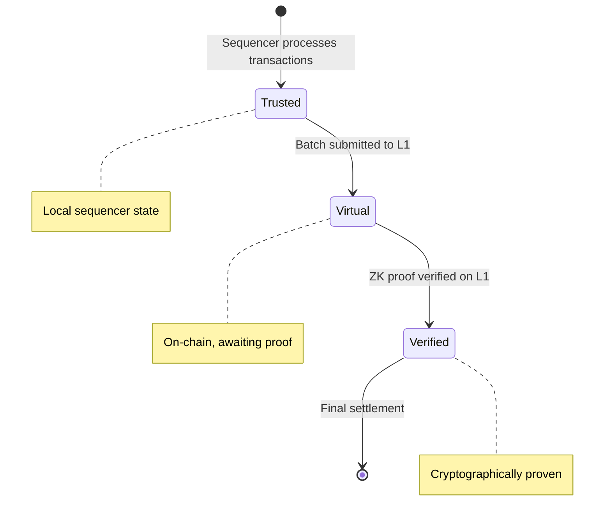
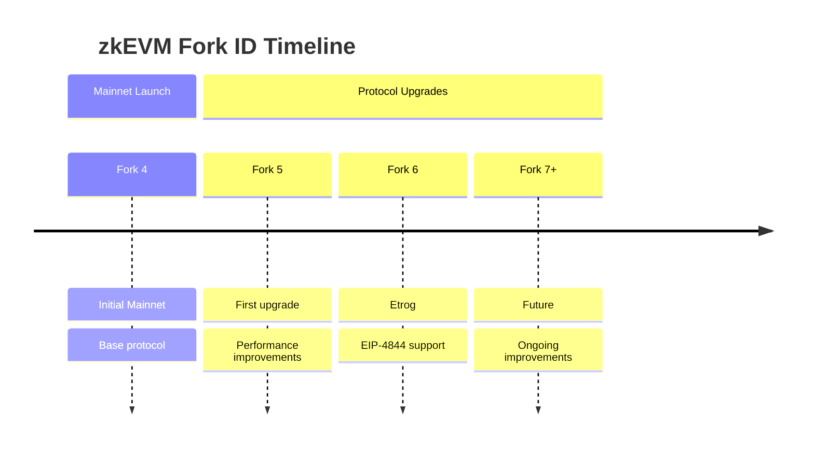

# Concepts

## Batches vs Blocks

In zkEVM, transactions are organized into **batches** for proof generation. See [Polygon's batch documentation](https://docs.polygon.technology/zkEVM/architecture/high-level/smart-contracts/sequencing-batches/) for L1 contract details.

- **Block**: Standard Ethereum block containing transactions
- **Batch**: Collection of blocks submitted together for ZK proof generation — query with [`zkevm_batchNumber`](../api/zkevm/batch-methods#zkevm_batchnumber)
- **Sequence**: Multiple batches submitted to L1 in a single transaction

## State Types

cdk-erigon supports two state trie implementations:

### Sparse Merkle Tree (SMT)

The SMT is zkEVM's native state representation. See [Polygon's SMT documentation](https://docs.polygon.technology/zkEVM/concepts/sparse-merkle-trees/sparse-merkle-tree/) for technical details.

- Uses [Poseidon hashing](https://docs.polygon.technology/zkEVM/concepts/sparse-merkle-trees/detailed-smt/) (ZK-friendly)
- Required for proof generation
- Default for zkEVM networks
- Configure with [`--zkevm.smt`](../configuration/state-trie#sparse-merkle-tree)

### Patricia Merkle Trie (PMT)

The PMT is Erigon's standard state representation. See [Erigon's state documentation](https://erigon.gitbook.io/erigon) for details.

- Standard Ethereum trie
- Compatible with existing tooling
- Used for non-ZK operations

## Finality States

zkEVM uses a multi-stage finality model. See [Polygon's finality documentation](https://docs.polygon.technology/zkEVM/architecture/high-level/smart-contracts/verification/) for verification details.

| State | Description | API Method |
|-------|-------------|------------|
| **Trusted** | Sequencer has processed, not yet on L1 | [`zkevm_batchNumber`](../api/zkevm/batch-methods#zkevm_batchnumber) |
| **Virtual** | Submitted to L1, not yet proven | [`zkevm_virtualBatchNumber`](../api/zkevm/batch-methods#zkevm_virtualbatchnumber) |
| **Verified** | ZK proof verified on L1 | [`zkevm_verifiedBatchNumber`](../api/zkevm/batch-methods#zkevm_verifiedbatchnumber) |

## Operational Modes

See [Operational Modes](../running/operational-modes) for detailed setup instructions.

### RPC Node

- Read-only synchronization — see [RPC Node Setup](../running/rpc-node)
- Connects to sequencer via [data stream](../configuration/data-stream)
- Serves JSON-RPC requests — see [API Overview](../api/overview)

### Sequencer

- Produces new blocks — see [Sequencer Setup](../running/sequencer)
- Manages transaction pool
- Requires [executor connection](../integration/prover) for proof generation

## Fork IDs

Fork IDs track protocol upgrades. See [Polygon's upgrade documentation](https://docs.polygon.technology/zkEVM/architecture/high-level/smart-contracts/api/upgradability/) for upgrade mechanics.

| Fork ID | Description | API |
|---------|-------------|-----|
| 4 | Initial Mainnet | [`zkevm_getForkId`](../api/zkevm/fork-methods#zkevm_getforkid) |
| 5 | First upgrade | [`zkevm_getForkIdByBatchNumber`](../api/zkevm/fork-methods#zkevm_getforkidbybatchnumber) |
| 6+ | Subsequent upgrades | See [Upgrading](../operations/upgrading) |

## Next Steps

- [Installation](../installation/index) - Install cdk-erigon
- [Configuration](../configuration/zkevm-namespace) - zkEVM-specific options
- [Glossary](../glossary) - Term definitions

## External Resources

- [zkEVM State Management](https://docs.polygon.technology/zkEVM/architecture/high-level/smart-contracts/state-management/) - L1 state roots
- [zkEVM Transaction Flow](https://docs.polygon.technology/zkEVM/architecture/high-level/smart-contracts/sequencing-batches/) - Batch lifecycle
- [CDK Components](https://docs.polygon.technology/cdk/architecture/cdk-zkevm/) - Full stack overview
