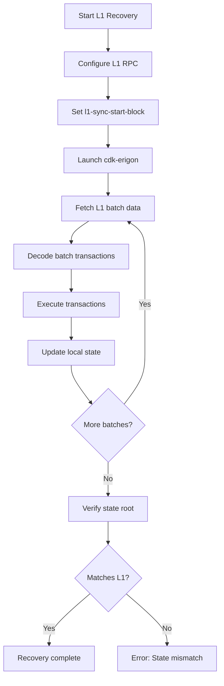

# L1 Recovery Mode

L1 Recovery Mode allows you to rebuild the entire chain state by reading batch data directly from L1 Ethereum smart contracts. This is slower than data stream synchronization but provides the highest level of trust since all data is verified against the L1 blockchain.

## When to Use L1 Recovery

L1 Recovery is appropriate in several scenarios:

| Scenario | Description |
|----------|-------------|
| **Corrupted state** | Local database corruption requiring full rebuild |
| **Fresh start** | Starting without snapshots or data stream access |
| **State verification** | Auditing chain state against L1 contract data |
| **Network recovery** | Reconstructing state after network-wide issues |
| **Forensic analysis** | Investigating historical state at specific batches |

:::caution Performance Impact
L1 Recovery is significantly slower than data stream sync. For typical RPC node operation, use the data stream unless you have specific reasons to recover from L1.
:::

## Prerequisites

Before starting L1 recovery, ensure you have:

1. **Archive L1 RPC endpoint** - Standard endpoints won't have historical state
2. **Contract addresses** - Rollup, zkEVM, and GER manager addresses
3. **L1 first block** - The block where the rollup contracts were deployed
4. **Sufficient disk space** - Full state reconstruction requires significant storage
5. **Time** - Recovery is much slower than data stream sync

## Configuration Options

### Core Recovery Flags

#### zkevm.l1-sync-start-block

The L1 block number to begin recovery from. Setting this value activates L1 recovery mode.

```yaml
# config.yaml
zkevm:
  l1-sync-start-block: 16000000
```

```bash
# CLI
cdk-erigon --zkevm.l1-sync-start-block=16000000
```

:::tip Finding the Start Block
Use the L1 block where the rollup was created. For zkEVM mainnet, this is typically around block 16896700. Check the rollup manager contract deployment transaction for the exact block.
:::

#### zkevm.sync-limit

Limits synchronization to a specific batch number. Useful for partial recovery or debugging.

```yaml
zkevm:
  sync-limit: 500000
```

```bash
cdk-erigon --zkevm.sync-limit=500000
```

#### zkevm.sync-limit-verified-enabled

When enabled, limits sync to verified batches plus a buffer of unverified batches.

```yaml
zkevm:
  sync-limit-verified-enabled: true
  sync-limit-unverified-count: 5  # Sync 5 batches past verified
```

#### zkevm.recovery-stop-batch

Stops recovery at a specific batch number (useful for debugging).

```yaml
zkevm:
  recovery-stop-batch: 100
```

### L1 Connection Configuration

```yaml
zkevm:
  # L1 RPC endpoint (archive node required)
  l1-rpc-url: https://eth-mainnet.example.com

  # L1 chain ID
  l1-chain-id: 1

  # Block finality for queries (finalized recommended)
  l1-highest-block-type: finalized

  # First L1 block for contract queries
  l1-first-block: 16896700

  # Block range for log queries (tune based on RPC limits)
  l1-block-range: 10000

  # Delay between L1 queries (ms, prevents rate limiting)
  l1-query-delay: 100
```

### Contract Addresses

```yaml
zkevm:
  # Retrieve addresses from L1 contracts automatically
  l1-contract-address-retrieve: true

  # Or specify manually
  address-rollup: "0x5132A183E9F3CB7C848b0AAC5Ae0c4f0491B7aB2"
  address-zkevm: "0x519E42c24163192Dca44CD3fBDCEBF6be9130987"
  address-ger-manager: "0x580bda1e7A0CFAe92Fa7F6c20A3794F169CE3CFb"
  l1-rollup-id: 1
```

## ForkID8 (Elderberry) Requirements

ForkID8 (Elderberry) introduced important changes that affect L1 recovery:

### What Changed in ForkID8

| Change | Pre-ForkID8 | ForkID8+ |
|--------|-------------|----------|
| **Gas limit** | Variable | Fixed at 1125899906842624 |
| **CumulativeGasUsed** | Same as GasUsed | Properly accumulated |
| **Log data padding** | Inconsistent | Standardized 32-byte padding |
| **Precompiles** | Limited set | Extended set available |

### Recovery Implications

When recovering chains that span the ForkID8 boundary:

1. **Receipt derivation** behaves differently before/after ForkID8
2. **Block gas limit** changes at the fork boundary
3. **Log padding** rules change for event data

The recovery process handles these automatically, but be aware that pre-ForkID8 blocks may have different characteristics.

## Step-by-Step Recovery Process

### Step 1: Prepare Configuration

Create a complete configuration file:

```yaml
# l1-recovery-config.yaml
datadir: /data/cdk-erigon

# Network identification
chain: zkevm-mainnet

# L1 Connection
zkevm:
  l1-chain-id: 1
  l1-rpc-url: https://eth-mainnet.example.com
  l1-highest-block-type: finalized
  l1-first-block: 16896700
  l1-block-range: 5000
  l1-query-delay: 100

  # Recovery mode activation
  l1-sync-start-block: 16896700

  # Contract addresses (or use l1-contract-address-retrieve: true)
  l1-contract-address-retrieve: true
  l1-rollup-id: 1

  # L2 configuration
  l2-chain-id: 1101

# Optional: Limit recovery scope for testing
# zkevm:
#   sync-limit: 1000
#   recovery-stop-batch: 100
```

### Step 2: Clear Existing State (If Needed)

```bash
# Stop any running instance
systemctl stop cdk-erigon

# Backup existing data (optional)
mv /data/cdk-erigon /data/cdk-erigon-backup-$(date +%Y%m%d)

# Create fresh data directory
mkdir -p /data/cdk-erigon
```

### Step 3: Start Recovery

```bash
# Start with recovery configuration
cdk-erigon --config l1-recovery-config.yaml

# Or with explicit flags
cdk-erigon \
  --datadir=/data/cdk-erigon \
  --chain=zkevm-mainnet \
  --zkevm.l1-rpc-url=https://eth-mainnet.example.com \
  --zkevm.l1-sync-start-block=16896700 \
  --zkevm.l1-first-block=16896700 \
  --zkevm.l1-contract-address-retrieve=true \
  --zkevm.l1-rollup-id=1
```

### Step 4: Monitor Progress

Watch the logs for recovery progress:

```bash
# Follow recovery progress
tail -f /var/log/cdk-erigon.log | grep -E "(L1|recovery|batch|sync)"
```

Example log output during recovery:

```
INFO [L1SequencerSync] Starting L1 Sequencer sync stage
INFO [L1SequencerSync] Waiting for L1 block 16896700 to be finalized
INFO [SequenceExecute] L1 recovery beginning for batch batch=42
INFO [SequenceExecute] L1 recovery has completed! batch=42
INFO [L1SequencerSync] L1 Sequencer sync finished
```

### Step 5: Verify Recovery

After recovery completes, verify the state:

```bash
# Check latest block
curl -X POST http://localhost:8545 \
  -H "Content-Type: application/json" \
  -d '{"jsonrpc":"2.0","method":"eth_blockNumber","params":[],"id":1}'

# Check latest batch
curl -X POST http://localhost:8545 \
  -H "Content-Type: application/json" \
  -d '{"jsonrpc":"2.0","method":"zkevm_batchNumber","params":[],"id":1}'

# Verify batch details
curl -X POST http://localhost:8545 \
  -H "Content-Type: application/json" \
  -d '{"jsonrpc":"2.0","method":"zkevm_getBatchByNumber","params":["latest",false],"id":1}'
```

## Blob Recovery Mode

For chains using blob data availability (post-EIP-4844), use blob recovery instead of or in addition to L1 recovery:

```yaml
zkevm:
  # Enable blob recovery
  blob-recovery: true

  # Blob DA service URL
  blob-da-url: https://blob-da.example.com

  # Blobs per request (tune for performance)
  blob-recovery-blob-limit: 10
```



```bash
cdk-erigon \
  --zkevm.blob-recovery=true \
  --zkevm.blob-da-url=https://blob-da.example.com \
  --zkevm.blob-recovery-blob-limit=10
```

:::note Mutual Exclusivity
L1 recovery (`l1-sync-start-block`) and blob recovery (`blob-recovery`) are mutually exclusive. If L1 recovery is enabled, blob recovery is automatically skipped.
:::

## Common Pitfalls

### 1. Non-Archive L1 RPC

**Symptom**: Errors about missing historical state or "header not found"

**Solution**: Use an archive L1 node or archive-enabled RPC service

```yaml
# Ensure your provider supports archive queries
zkevm:
  l1-rpc-url: https://eth-archive.example.com  # Must be archive node
```

### 2. Rate Limiting

**Symptom**: Frequent timeouts or "too many requests" errors

**Solution**: Adjust query delay and block range

```yaml
zkevm:
  l1-query-delay: 500      # Increase delay between queries
  l1-block-range: 1000     # Reduce blocks per query
```

### 3. Wrong Start Block

**Symptom**: Missing initial batches or contract not found errors

**Solution**: Find the correct rollup creation block

```bash
# Query the rollup manager for creation details
cast call $ROLLUP_MANAGER "rollupIDToRollupData(uint32)(address,uint64,address,uint64,bytes32,uint64,uint64,uint64,uint64,uint64,uint64,uint8)" 1 --rpc-url $L1_RPC
```

### 4. Incorrect Contract Addresses

**Symptom**: Empty batches or decode errors

**Solution**: Use automatic address retrieval or verify addresses manually

```yaml
zkevm:
  l1-contract-address-retrieve: true  # Let cdk-erigon find addresses
  l1-contract-address-check: true     # Verify addresses match
```

### 5. Insufficient Disk Space

**Symptom**: Write errors or database corruption

**Solution**: Ensure adequate space before starting

```bash
# Check available space (need at least 500GB for mainnet)
df -h /data/cdk-erigon

# Monitor during recovery
watch -n 60 'df -h /data/cdk-erigon'
```

### 6. L1 Finalization Timeout

**Symptom**: "Waiting for L1 block to be finalized" message persists

**Solution**: Check L1 finalization block requirement

```yaml
zkevm:
  # Set to 0 to skip finalization check (use with caution)
  l1-finalized-block-requirement: 0

  # Or use 'safe' instead of 'finalized'
  l1-highest-block-type: safe
```

## Verification Steps

After recovery, verify data integrity:

### 1. Check Block Consistency

```bash
# Get block by number and verify hash
curl -X POST http://localhost:8545 \
  -H "Content-Type: application/json" \
  -d '{
    "jsonrpc": "2.0",
    "method": "eth_getBlockByNumber",
    "params": ["0x1", false],
    "id": 1
  }'
```

### 2. Verify Batch State Root

```bash
# Compare batch state root with L1 contract
curl -X POST http://localhost:8545 \
  -H "Content-Type: application/json" \
  -d '{
    "jsonrpc": "2.0",
    "method": "zkevm_getBatchByNumber",
    "params": ["0x64", true],
    "id": 1
  }' | jq '.result.stateRoot'
```

### 3. Check Fork History

```bash
# Verify fork ID at specific block
curl -X POST http://localhost:8545 \
  -H "Content-Type: application/json" \
  -d '{
    "jsonrpc": "2.0",
    "method": "zkevm_getForkIdByBatchNumber",
    "params": ["0x64"],
    "id": 1
  }'
```

### 4. Validate Transaction Receipts

```bash
# Get receipt and verify fields
curl -X POST http://localhost:8545 \
  -H "Content-Type: application/json" \
  -d '{
    "jsonrpc": "2.0",
    "method": "eth_getTransactionReceipt",
    "params": ["0x...txhash..."],
    "id": 1
  }'
```

## API Reference

### Recovery-Related RPC Methods

| Method | Description |
|--------|-------------|
| `zkevm_batchNumber` | Get current batch number |
| `zkevm_virtualBatchNumber` | Get highest virtual batch |
| `zkevm_verifiedBatchNumber` | Get highest verified batch |
| `zkevm_getBatchByNumber` | Get batch details |
| `zkevm_getForkIdByBatchNumber` | Get fork ID for batch |
| `zkevm_isBlockConsolidated` | Check if block is finalized |

### Monitoring Recovery Progress

```bash
# Check sync progress
curl -X POST http://localhost:8545 \
  -H "Content-Type: application/json" \
  -d '{"jsonrpc":"2.0","method":"eth_syncing","params":[],"id":1}'

# Get batch numbers for comparison
curl -X POST http://localhost:8545 \
  -H "Content-Type: application/json" \
  -d '{"jsonrpc":"2.0","method":"zkevm_batchNumber","params":[],"id":1}'
```

## Transitioning After Recovery

Once L1 recovery completes, transition to normal operation:

### 1. Stop the Node

```bash
systemctl stop cdk-erigon
```

### 2. Update Configuration

Remove or comment out recovery flags:

```yaml
zkevm:
  # Remove or comment these lines
  # l1-sync-start-block: 16896700
  # recovery-stop-batch: 100

  # Enable data stream for normal sync
  l2-datastreamer-url: stream.zkevm.example.com:6900
```

### 3. Restart for Normal Operation

```bash
systemctl start cdk-erigon
```

## Next Steps

- [Performance Tuning](./performance-tuning) - Optimize recovery and sync performance
- [Backup and Recovery](./backup-recovery) - Backup strategies for recovered state
- [Troubleshooting](../troubleshooting/sync-issues) - Diagnose sync problems
- [L1 Interaction](../configuration/l1-interaction) - Configure L1 connection
