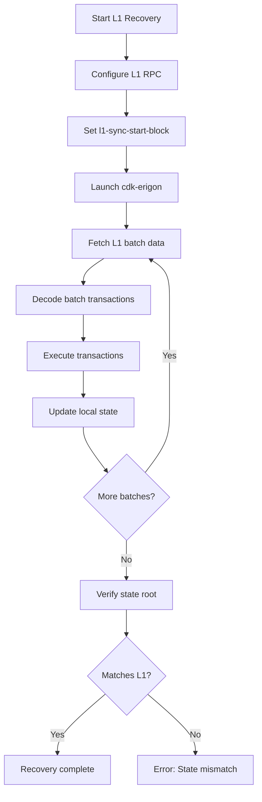

# L1 Recovery

Rebuild chain state from L1 Ethereum data.

## When to Use

- Corrupted local state
- Starting fresh without snapshots
- Verifying state against L1

## Configuration

Enable L1 recovery mode:

```yaml
zkevm:
  l1-sync-start-block: 16000000
  sync-limit: 1000000
```

## Process

1. Configure L1 RPC with archive access
2. Set `l1-sync-start-block` to rollup creation block
3. Optionally set `sync-limit` to limit sync height
4. Start cdk-erigon



```bash
cdk-erigon \
  --config config.yaml \
  --zkevm.l1-sync-start-block=16000000
```

## Requirements

- Archive L1 RPC endpoint
- Sufficient time for full reconstruction
- Adequate disk space

## Monitoring Progress

Watch logs for L1 sync progress:

```bash
tail -f /var/log/cdk-erigon.log | grep "L1 sync"
```

## Next Steps

- [Performance Tuning](./performance-tuning) - Optimize recovery
- [Troubleshooting](../troubleshooting/sync-issues) - Fix sync issues
