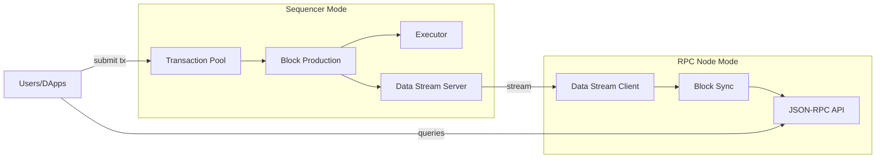

# Operational Modes

cdk-erigon operates in two primary modes.

## RPC Node

Default mode for read-only synchronization.

| Feature | Support |
|---------|---------|
| Block sync | ✅ |
| JSON-RPC | ✅ |
| Transaction submission | ✅ (forwarded) |
| Block production | ❌ |

## Sequencer

Block production mode for chain operators.

| Feature | Support |
|---------|---------|
| Block sync | ✅ |
| JSON-RPC | ✅ |
| Transaction submission | ✅ (processed) |
| Block production | ✅ |

Enable with `CDK_ERIGON_SEQUENCER=1`.

## Comparison

| Aspect | RPC Node | Sequencer |
|--------|----------|-----------|
| Use Case | Public RPC | Chain operator |
| Resources | Lower | Higher |
| Complexity | Simple | Complex |
| Executor | Optional | Required |

## Next Steps

- [Migration](./migration) - Switching modes
- [Sequencer Setup](./sequencer) - Configure sequencer
